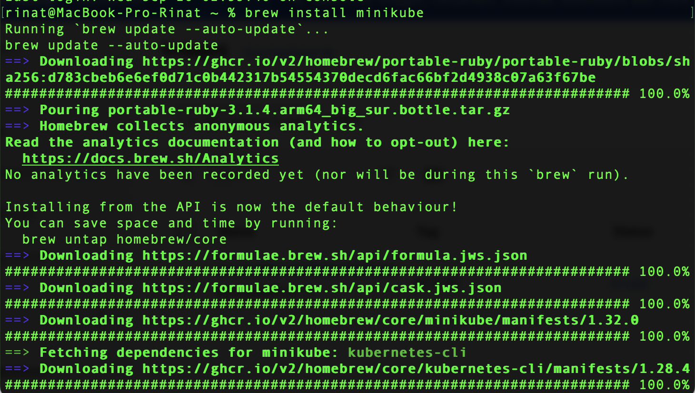
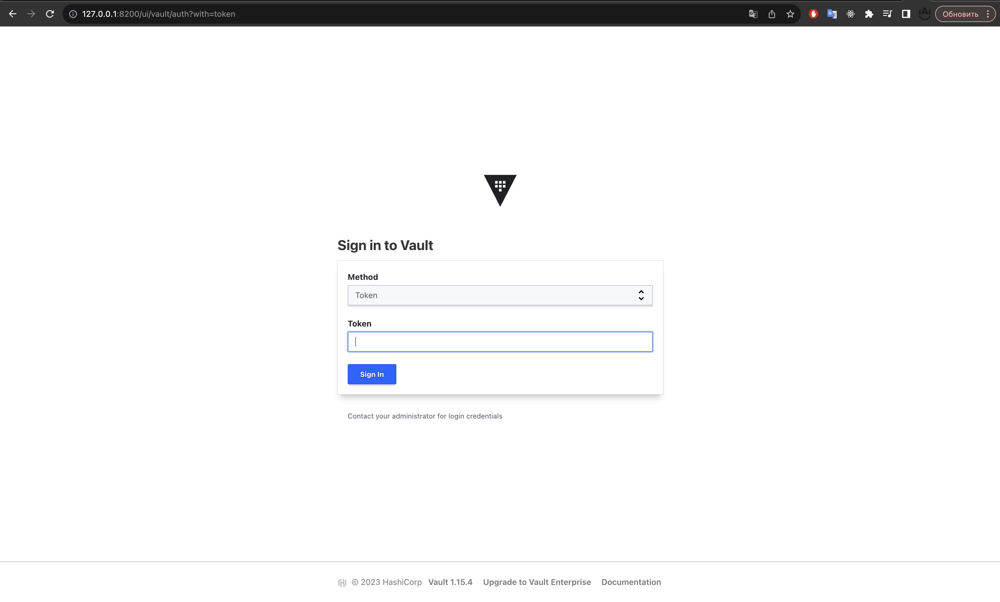

University: [ITMO University](https://itmo.ru/ru/)
Faculty: [FICT](https://fict.itmo.ru)
Course: [Introduction to distributed technologies](https://github.com/itmo-ict-faculty/introduction-to-distributed-technologies)
Year: 2023/2024
Group: K4111c
Author: Gabdrashitov Rinat Ramilevich
Lab: Lab1
Date of create: 06.12.2023
Date of finished: -.12.2023

## Лабораторная работа №1 "Установка Docker и Minikube, мой первый манифест."
### Описание
Это первая лабораторная работа в которой вы сможете протестировать Docker, установить Minikube и развернуть свой первый "под".

### Цель работы
Ознакомиться с инструментами Minikube и Docker, развернуть свой первый "под".

### Ход работы

- Установить Minikube

- Разворачивание minikube cluster

### 1 вопрос
- Создание пода с использованием манифеста
- Создание сервиса для доступа к контейнеру
- Прокидывание порта компьютера в контейнер

### 2 вопрос
- Входим в vault используя токен (в логах пода смотрим токен)

### Схема организации контейнеров

