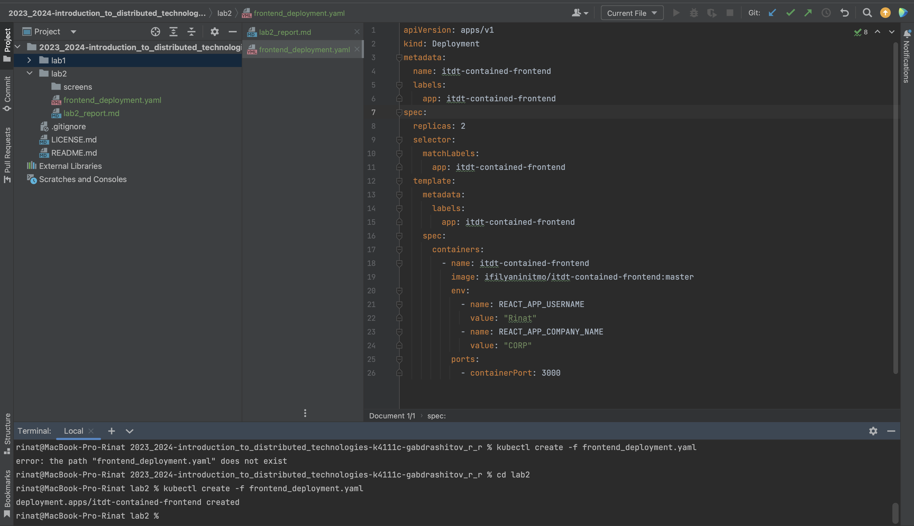

University: [ITMO University](https://itmo.ru/ru/)
Faculty: [FICT](https://fict.itmo.ru)
Course: [Introduction to distributed technologies](https://github.com/itmo-ict-faculty/introduction-to-distributed-technologies)
Year: 2023/2024
Group: K4111c
Author: Gabdrashitov Rinat Ramilevich
Lab: Lab2
Date of create: 14.12.2023
Date of finished: 14.12.2023

## Лабораторная работа №2 "Развертывание веб сервиса в Minikube, доступ к веб интерфейсу сервиса. Мониторинг сервиса."
### Описание
В данной лабораторной работе вы познакомитесь с развертыванием полноценного веб сервиса с несколькими репликами.

### Цель работы
Ознакомиться с типами "контроллеров" развертывания контейнеров, ознакомится с сетевыми сервисами и развернуть свое веб приложение.

### Ход работы

- Запуск minikube cluster

- Создаем файл deployment'а и запускаем

- Создаем сервис и прокидываем порт для доступа

- Развернутое приложение в браузере на localhost:3000 (127.0.0.1:3000)

Значения user и company будут неизменными, имя контейнера и IP могут изменяться в зависисмости от того, в какой контейнер попал запрос

- Логи контейнеров

### Схема организации контейнеров

