University: [ITMO University](https://itmo.ru/ru/)
Faculty: [FICT](https://fict.itmo.ru)
Course: [Introduction to distributed technologies](https://github.com/itmo-ict-faculty/introduction-to-distributed-technologies)
Year: 2023/2024
Group: K4111c
Author: Gabdrashitov Rinat Ramilevich
Lab: Lab3
Date of create: 20.12.2023
Date of finished: -.12.2023

## Лабораторная работа №3 "Сертификаты и "секреты" в Minikube, безопасное хранение данных."

### Описание
В данной лабораторной работе мы познакомимся с сертификатами и "секретами" в Minikube, правилами безопасного хранения данных в Minikube.

### Цель работы
Познакомиться с сертификатами и "секретами" в Minikube, правилами безопасного хранения данных в Minikube.

### Ход работы
- Создаем config-map с переменными REACT_APP_USERNAME = Rinat, REACT_APP_COMPANY_NAME = CORP3. ConfigMap — это объект Kubernetes, который используется для хранения несекретных данных в паре «ключ-значение».
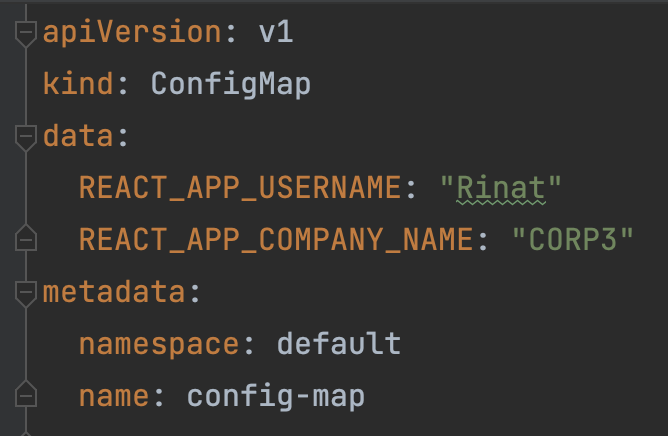
- Создаем манифест для replica-set, передадим значения переменных из config-map.
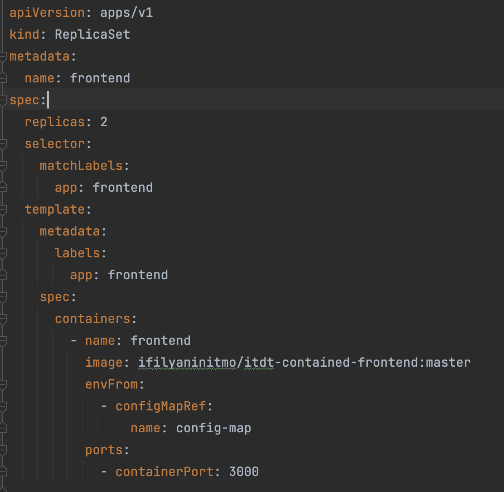
- Создаем Service для доступа к приложению.
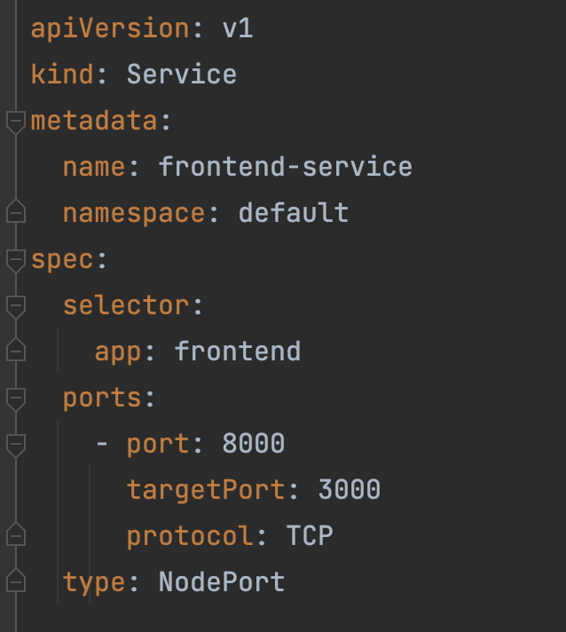
- Создаем сертификат c помощью утилиты openssl и ипортируем его в secret
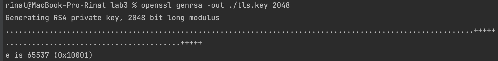
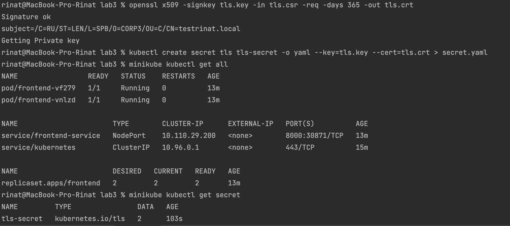
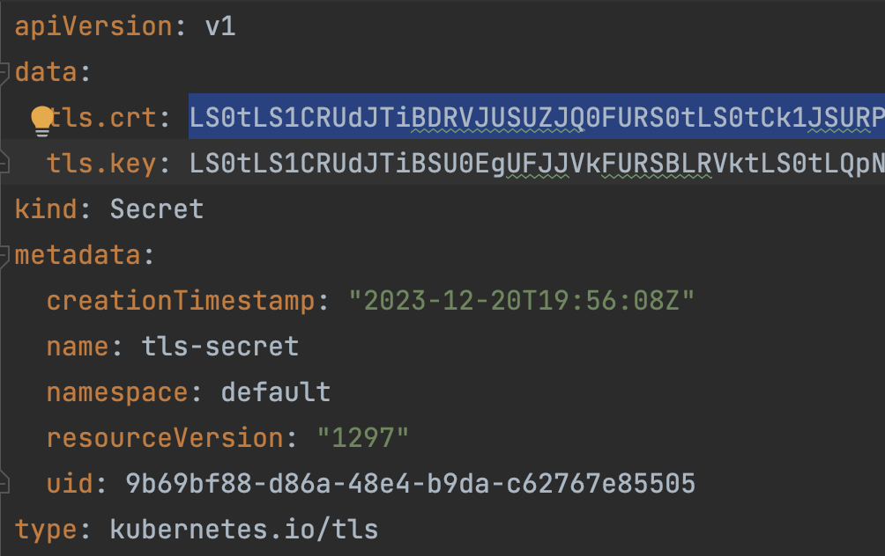
- Создаем Ingress и указываем в нем созданный секрет и домен
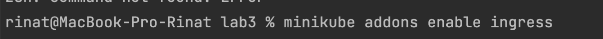
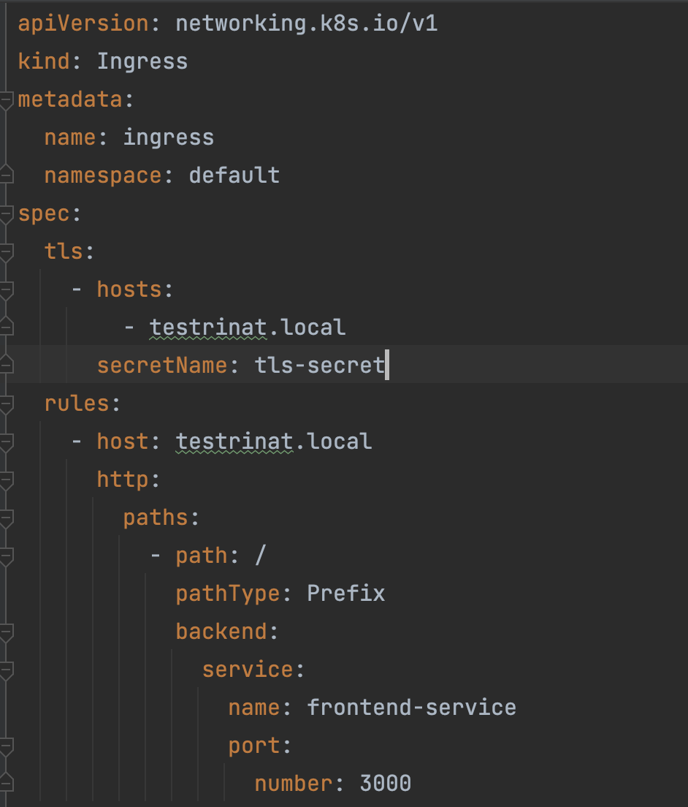
- Применяем все манифесты
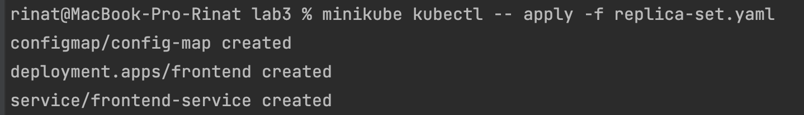
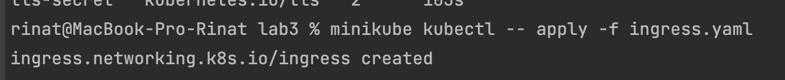
- Заходим в hosts и добавляем наш домен
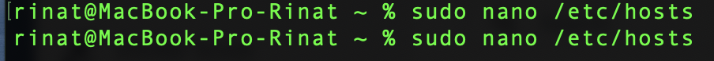
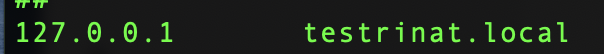
- Запуск tunnel
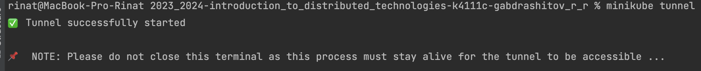
- Переходим по адресу testrinat.local и видим что переменные соответствуют нашим. Можно просмотреть сертификат и убедиться, что он соответсвует нашему.
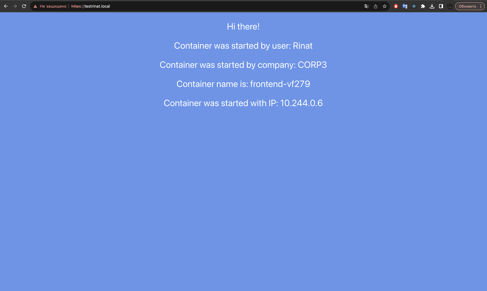
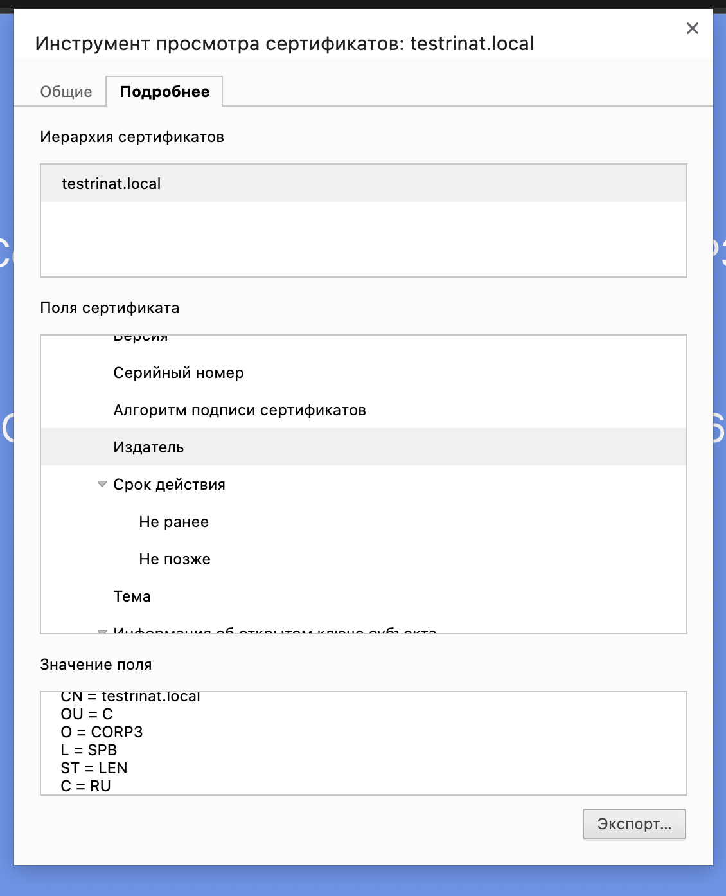
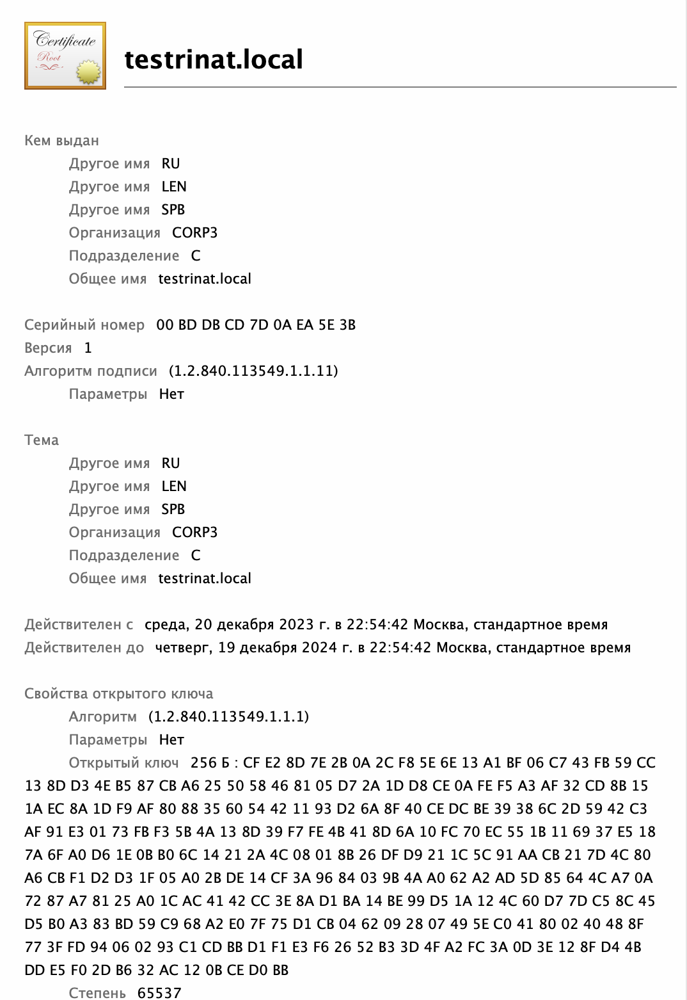